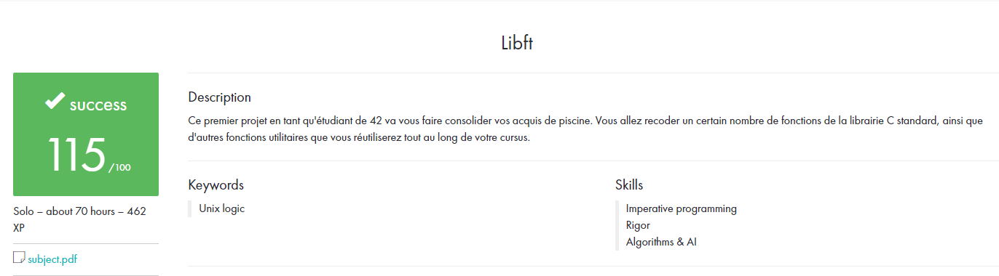

# Libft - @42Paris
 
My implementation of some of the Standard C Library functions including some additional ones.

### TOC
* [What is libft?](#what-is-libft)
* [What's in it?](#whats-in-it)
* [How does it work?](#how-does-it-work)
* [Example usage](#example-usage)
* [Final Note](#final-note)

### What is libft?
Libft is an individual project at [42][1] that requires us to re-create some standard C library functions including some additional ones that can be used later to build a library of useful functions for the rest of the program.

Disclaimer: *Reinventing the wheel is bad, 42 makes us do this just so we can have a deeper understanding of data structures and basic algorithms. At 42 we're not allowed to use some standard libraries on our projects, so we have to keep growing this library with our own functions as we go farther in the program.*

**WARNING:** *This version of the project is not the original version, but an improved version. Note that this version does not respect certain guidelines of the basic project.*

### What's in it?

There are 4 sections:

1.  **Libc Functions:** Some of the standard C functions
2.  **Additional functions:** Functions 42 deems will be useful for later projects
3.  **Bonus Functions:** Functions 42 deems will be useful for linked list manipulation
4.  **Personal Functions:** Functions I believe will be useful later.

Notes:

- Most of the the files and function names are namespaced with an **ft** in front. It stands for Fourty Two
- Normally, the project instructions require that we put all the source files in the root directory but as i said in the warning, this version is an improved version of the original project.

My code is not the best, but it passed all the 42 tests successfully.

### How does it work?

The goal is to create a library called libft.a from the source files so I can later use that library from other projects at 42.

To create that library, after downloading/cloning this project, **cd** into the project, copy all the files from the sub folders to the root directory and finally, call make:

	git clone git@github.com:TheoZerbibi/Libft.git
	cd libft
	make

You should see a *libft.a* file and some object files (.o).

Now to clean up, call `make clean` and `make fclean` for cleaning all the generate file (.o and .a)

### How do I use the library?

I added an example file called **example.c** in example folder, it's using the function **ft_putstr** to print "HELLO GUYS !" to the screen. 

If you try to compile it with gcc using `gcc example.c` you will get an *undefined symbol* error for ft_putstr. 

You have to tell the file where your library resides and which library it is using:

`gcc exemple/example.c -L. -lft -o exemple.out`

-L takes the path to your library. `.` in this case 
-l takes the name of your library. This is the set of characters that come after `lib` in your library name. 
-o will be the name of the binary to run

That's it. Now run it using `./exemple.out`

## Example usage

This is a list of my projects that use Libft extensively:

* [get_next_line]()
* [ft_printf]()
* [so_long]()

## Final note

Validate on: 2019-11-15

Disclaimer: #README is based on this [README](https://github.com/nickdotht/libft/blob/master/README.md).

Enjoy.

[1]: https://42.fr "42"
